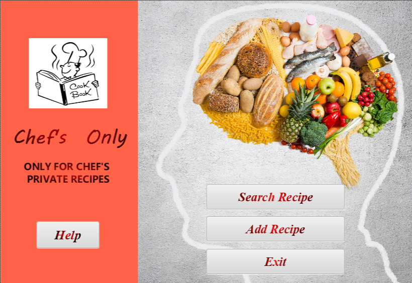
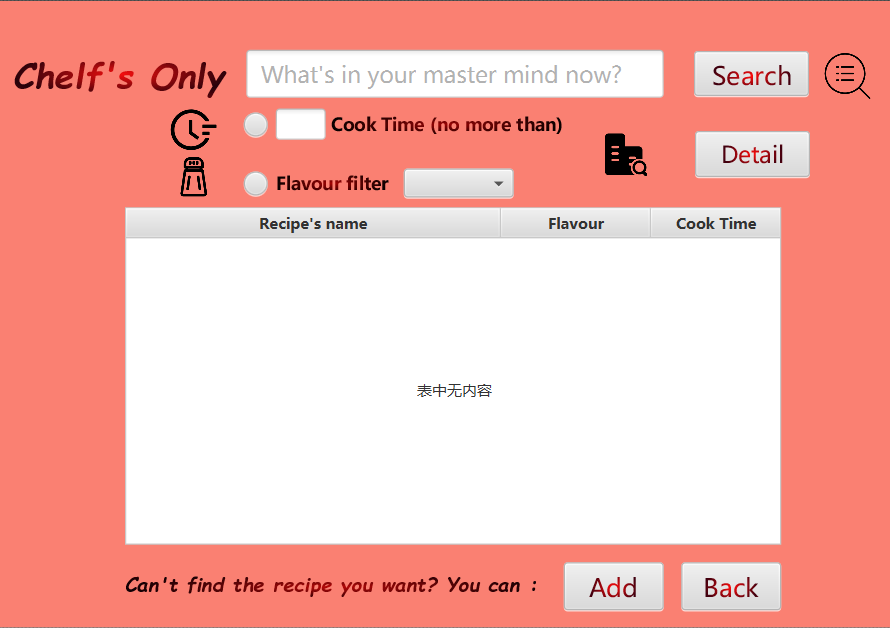
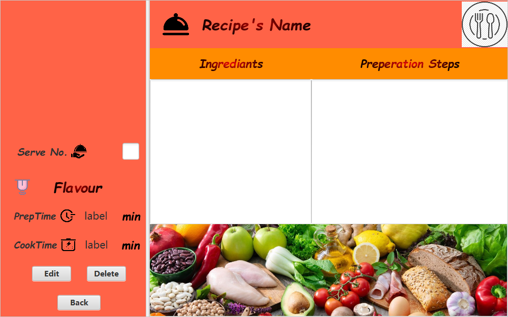
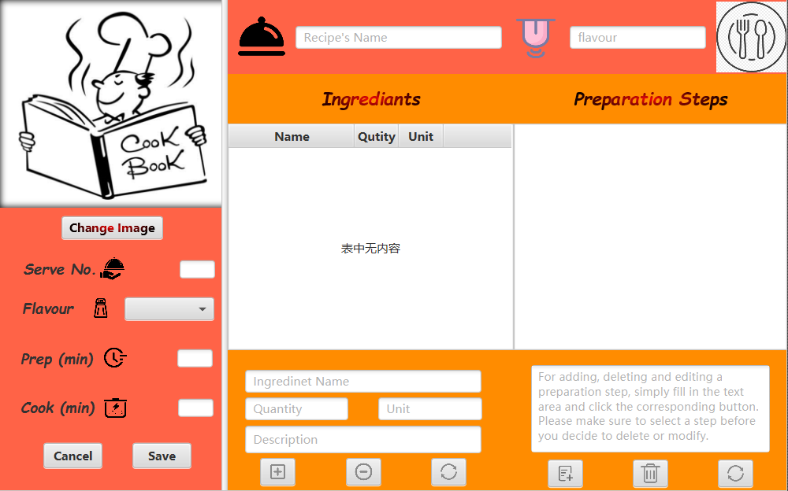

# Digital Cookbook

Digital Cookbook implemented in Java FX, MySQL, used Maven to manage. If you had any questions or constructive suggestions or found bugs regarding our projects, feel free to contact me or simply [create an issue](https://github.com/yuk-kei/Digital-CookBook/issues):

## Brief Introduction

- **What is Chef Only?**

  Have you ever wonder what to cook each day? Then you should try our Chef's Only! It is a digital cook book which helps you to manage the recipe easily . 

- **GUI：**
  
  - Home Window
  
    
  
  - Search Window
  
    
  
  - View Recipe Window
  
    
  
  - Add / Edit Recipe Window
  
    


## How to build this project ?

### Prerequisites for Environment :

- **Operating System:** Windows, Mac & Linux based systems 
- **Software Development Kit:** JDK 11+ is recommended
- **Management tool:** Maven
- **Database:** MySQL server (8+ is recommended)

### Set up ( example for IntelliJ Idea ):

- Clone this project or just download it

- Open this project in IntelliJ and wait until maven has downloaded all the needed dependencies.

- Execute the SQL file **guide/cookbook.sql** in your database.

- Find the following code in **"src/main/java/chefOnly/utils/ConnectionUtil.java"** 

  ```` java
  try {
      Class.forName("com.mysql.cj.jdbc.Driver");
      connection = DriverManager.getConnection("jdbc:mysql://localhost:3306/cookbook?useSSL=false&characterEncoding=utf8&serverTimezone=UTC", "user", "password"};
      return connection;
      }
      // change ther "user" and "password" to your own username and password
      // if your are using sql connecter before 8, the Class.forName("com.mysql.jdbc.Driver")
  ````

  

- If you are using Java 11 and later, you should reference [this](https://www.jetbrains.com/help/idea/javafx.html#vm-options) to add a VM option  

- The Entrance of our Digital Cook book is at **"src/main/java/chefOnly/.Main.java"**,
  find and run it as Java Application. 

## Used Design Patterns

- **MVC**

